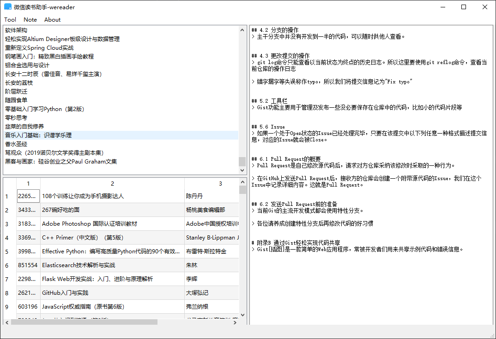

# 微信读书助手 wereader
作者 @arry-lee

## 2022-2-16 更新日志
1. 新增带有 GUI 的客户端，也可作为微信读书的桌面客户端。
2. 内嵌浏览器实现扫码登录后自动获取 cookie，原先的手动获取 cookie 的方法现已被移除。
3. 接口模块 `wereader.py` 中的各个接口函数引入新的形参 `cookie`, 移除了旧的 `COOKIE` 和 `USERID`；
4. 移除了旧版的 `settings.py` 暂且保留 `client.py` 作为可选的命令行客户端，扫码登录之后仍然能够使用。

## 阅读界面如下：

## 笔记界面如下：

## 声明
本程序没有爬取任何书籍内容，只提供了一个浏览器功能，所有阅读操作和在浏览器端的操作无异，没有侵犯书籍作者版权和微信读书官方利益。

## 主要功能

1. 获取书架上的书籍列表 `get_bookshelf`
2. 获取某本书的详情 `get_bookinfo`
3. 获取某本书的目录 `get_chapters`
4. 获取某本书你的全部笔记 `get_bookmarklist`
5. 获取你的所有有笔记的书单 `get_notebooklist`
6. 获取某一本书的热门划线 `get_bestbookmarks`

具体代码见 `wereader.py`

### 新版使用方法
1. 下载或克隆本项目
2. 安装所需依赖 `pip install -r requirements.txt`
3. 通过命令行 `cd path/to/wereader` 进入项目文件夹下，之后输入 `python main.py` 运行客户端 main.py
4. 扫码登录后再自行探索

扫码之后也通过命令行  `python client.py` 运行旧版的命令行客户端 client.py（不建议使用）

本项目如对您有所帮助，请给作者个小星星，谢谢~~~ 如有什么需求和问题也可以提 issue。

